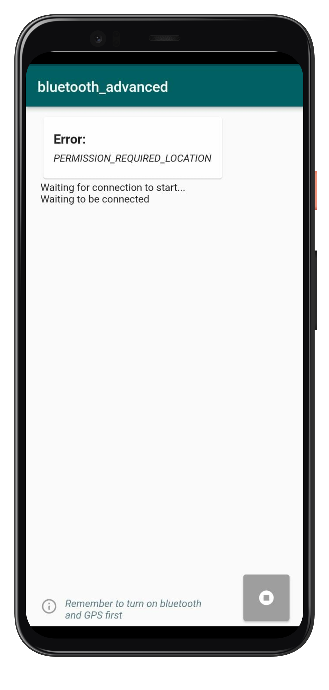
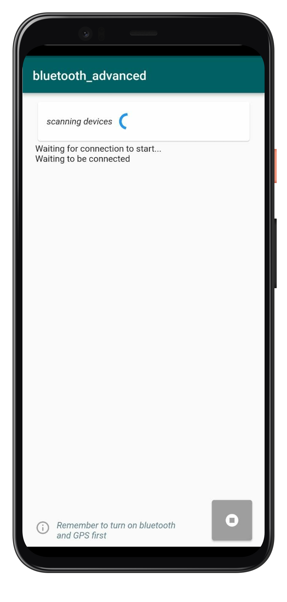

Flutter package to communicate with bluetooth device

## How to Use
To use bluetooth_advanced, follow the following steps:

##### Step1: Adding plugin dependency
add the plugin to your pubspec.yaml file:
```dart
bluetooth_advanced: [latest_version]
```

##### Step2: Importing the package.
import the plugin in [your_file].dart
```dart
import 'package:bluetooth_advanced/bluetooth_advanced.dart';
```

##### Step3: Init configuration details
here it is importance to set UUIDs that are similar to those used in your server device. UUIDs are unique identification information of your device which identifies the services provided by bluetooth device. Your application will connect to that device using this through standard protocols.
```dart
final _bluetoothAdvanced = BluetoothAdvanced();
print(await _bluetoothAdvanced.getDataCharactersticUUID());
print(await _bluetoothAdvanced.getServiceCharactersticUUID());
await _bluetoothAdvanced
          .setServiceCharactersticUUID([your_service_uuid]);
await _bluetoothAdvanced
          .setDataCharactersticUUID([your_data_uuid]);
```

##### Step4: Initialize Bluetooth
returns a stream which you can continously listen to:
```dart
_bluetoothAdvanced.initBluetooth();
```

##### Step5: Scan Devices  
returns a stream which you can continously listen to the following states:
| STATE               |                  DESCRIPTION                     | DATA TYPE/FORMAT|  
| :---                |                             :----            |            :----  |   
| SCANNING_STARTED    | Started Scanning a paired device |  String |
| SCANNING_FINISHED_WITH_NO_DEVICE   | no device found |  String |
| [device_address] , [device_name]   | return device address,name in comma seperated format  | String: "XX:XX:XX:XX:XX:XX,MyBluetoothDevice"

```dart
_bluetoothAdvanced.scanDevices();
```

##### Step6: Connect Device  
returns a stream which you can continously listen to the following states:
| STATE               |                  DESCRIPTION                     |  DATA TYPE / FORMAT |
| :---                |                             :----               |   :---- |
| DEVICE_RECOGNIZING  | Recognized the device with necessary information |  String |
| DEVICE_CONNECTING   | trying to connect with the device | String |
| DEVICE_CONNECTED    | established connection to the device | String |
| DEVICE_DISCONNECTED | connection aborted | String |
| DEVICE_CONNECTING_FAILED | trying to connect result failure | String |

```dart
_bluetoothAdvanced.connectDevice();
```

##### Step7: Listen to Data  
returns a stream which you can continously listen to the following states:
| STATE               |                  DESCRIPTION                     |  DATA TYPE / FORMAT |
| :---                |                             :----               |   :---- |
| DEVICE_DATA_INITIATED  | attempting data handshake with device |  String |
| DEVICE_DATA_CONNECTING   | trying to connect with the device to lsiten data | String |
| DEVICE_DATA_CONNECTED    | established connection to the device to listen data | String |
| DEVICE_DATA_AVAILABLE | data is received and available in a format | String : "DEVICE_DATA_AVAILABLE:this is tha data received" |
| DEVICE_DATA_DISCONNECTED | data connection was revoked | String |

```dart
_bluetoothAdvanced.listenData();
```

##### Step8: Revoke Connection
this will revoke connection with the device, if you dont call this function it will keep running in the background and will keep receiving data. 
```dart
_bluetoothAdvanced.dispose();
```


[Click here for more Example](https://pub.dev/packages/bluetooth_advanced/example)

| | | |  
| :---:     |       :----:          |   :----: |   :----:  |   


Created by [Javeria Iffat](https://www.linkedin.com/in/javeria-iffat/)
In case you need: to add new feature or you get any error or any help, please contact me at javeriaiffat312@gmail.com or javeria.iffat@lums.edu.pk
please be kind if you get any errors, text me I'll be more than happy to help you all.

